# How the Voron community embodies peer production

<!-- _class: leading -->
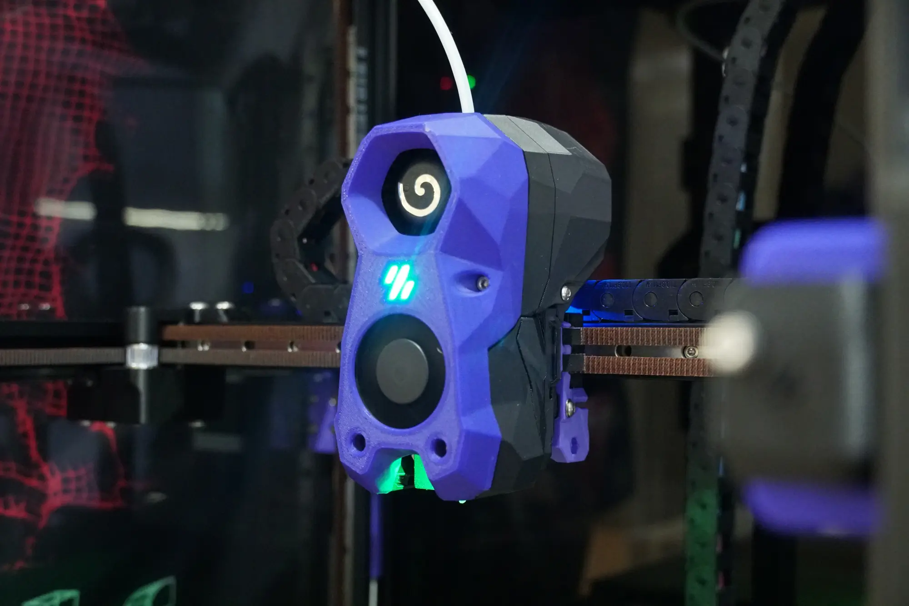

<!--
Hello!

I'm Thea, and today I'm going to give you a small look into the Voron project's extraordinarily interesting open hardware ecosystem.
-->

---

# Before we start

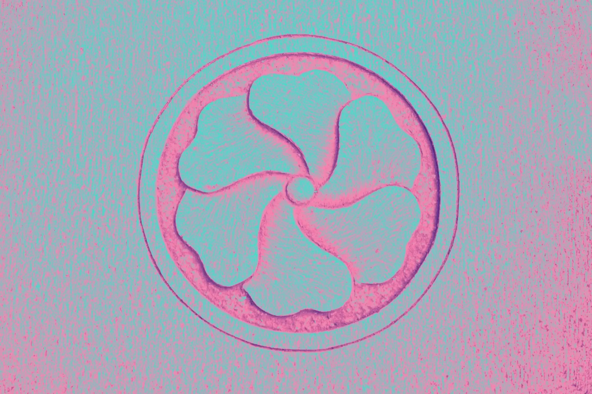

<!--
Before we start, I want to say that this brief talk doesn't even scratch the surface of all of the interesting things going on in the Voron community and the relationships between developers, users, vendors, and content creators, but I hope it encourages you to take a closer look.
-->

---

# What's a Voron?

<!-- _class: leading -->
<!-- footer: 'Image credit: [Matszew02](https://www.printables.com/model/546994-side-mounted-daylight-for-voron-v02-0-v0-02) on Printables' -->
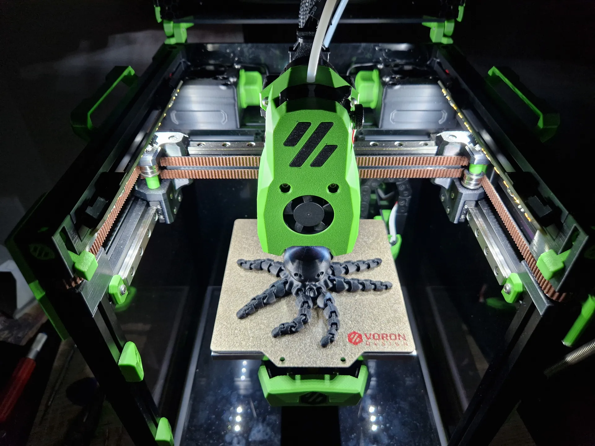

<!-- image credit: https://www.printables.com/model/546994-side-mounted-daylight-for-voron-v02-0-v0-02 -->

<!-- Voron Design has created a set of no-compromise, high quality 3d printers. The catch is that you don't really *buy* a Voron printer, you *build* **your** Voron printer. -->

---

# Open hardware

<!-- _class: screenshot -->
<!-- footer: '' -->
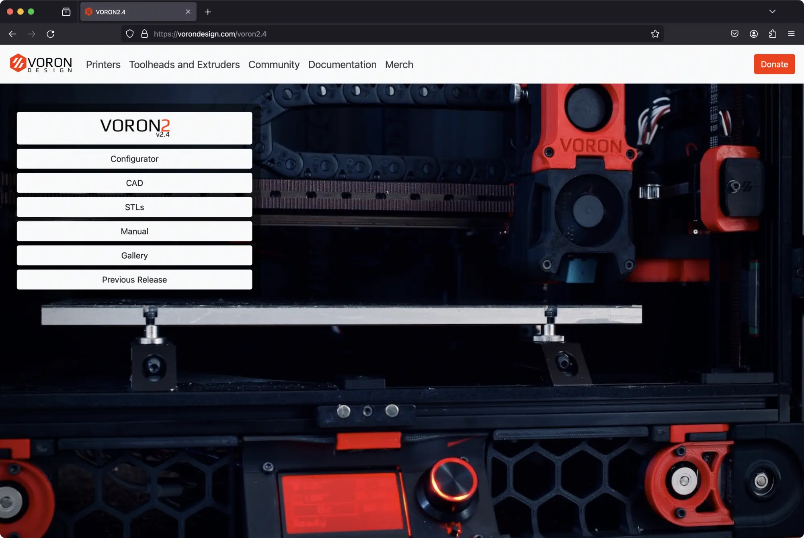

<!-- Voron Design doesn't sell printers or kits, they actually don't actually sell anything. Instead, they publish the designs, bill of materials, and assembly instructions for their printers under open source licenses for anyone to build themselves. -->

---

# Self-sourcing

<!-- _class: screenshot  -->

<!-- In the past, this meant that if you wanted a Voron you would have to go through the tedious process of sourcing everything in the bill of materials yourself before diving into building a wonderfully complex machine. However, that's rarely done these days. -->

---

# Vendors

<!-- _class:  screenshot  -->
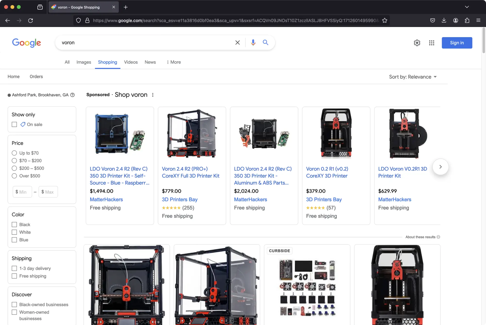

<!-- Instead, there's now a vibrant ecosystem of vendors that offer everything from pre-built, ready-to-go machines, to curated parts kits, to highly-optimized individual components. -->

---

# Vendor map

<!-- _class:  hide-title  -->

<!-- This ecosystem is brilliantly interesting because isn't ruthlessly competitive- generally speaking, vendors tend to be *complementary* to one another, differentiating themselves to suit specific needs in the community.

For example, some vendors might focus on budget-friendly all-in-one kits that lower the barrier of entry for newcomers while other vendors might specialize in one aspect of the machine, such as super high-end carbon fiber structural components or high-performance hotends. Meanwhile, other vendors can offer high-touch support, replacement parts, and resources to owners that don't want to tinker with their machine. -->

---

# Peer production

<!-- footer: 'Image credit: [Voron Design](https://vorondesign.com/)' -->

<!--
This vendor ecosystem and its "Big Tent" mentality has created a fantastic real-world example of what's called "Peer Production".
-->

---

# Distributed, self-organizing

<!-- footer: '' -->
<!-- _class: hide-title -->

<!--
Peer production is a way of producing goods that relies on *self-organzing*, *collaborative*, *largely distributed* communities of individuals. Familiar examples of this include Wikipedia and Linux.
-->

---

# Centralized

<!-- _class: hide-title -->
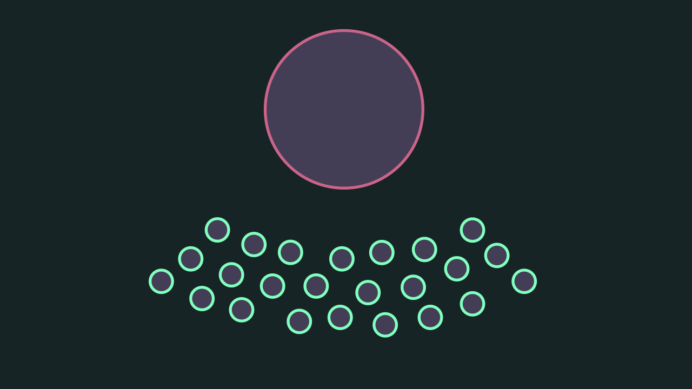

<!--
There are a lot of academic opinions around peer production, but it's largely contrasted to typical type of production that revolves around a single company producing goods.

Peer production flips the typical power structure on its head, distributing the rights and means of production across an participatory community.
-->

---

# Print-it-forward

<!-- footer: 'Image credit: [Fabreeko](https://www.fabreeko.com/collections/voron/products/voron-v2-4-printed-parts-by-pif?variant=43645783998719)' -->

<!--
One fantastic example of peer production within the Voron community is its Print-it-Forward program. Building a Voron requires several 3D printed parts which presents a problem if you don't already have a 3D printer. To solve this, the Voron community has created a group of volunteers who will print the parts and send them to you for essentially the cost of materials.
-->

---

# PIF in practice

<!-- footer: '' -->
<!-- _class:  screenshot -->

<!--
These volunteers are vetted by other members of the community and are located all over the world. Folks who need parts fill out a form and the volunteers pick the ones they want to take on, often meaning that you get parts from someone geographically nearby. This is an obvious example of *distributed*, *self-organizing*, production.
-->

---

# Vendors as peers

<!-- footer: 'Image credit: [MakeZine](https://makezine.com/article/technology/east-coast-reprap-festival-2022-back-in-person/)' -->

<!-- The vendor ecosystem isn't as clear cut as the print-it-forward program, but the key aspects of peer production are there. Vendors are distributed, specialized, self-organized, and need to be active participants in the community to truly succeed. -->

---

# Voron Tap

<!-- footer: '' -->
<!-- _class: screenshot -->

<!--
There's actually an interesting case study on the impact of collaboration between vendors and the community, it's the Voron Tap story.

The community and design team experimented with a new, interesting z-probe design called "Tap" that folks were really excited about.
-->

---

# CNC Tap

<!-- footer: 'Image credit: [Chaoticlab](https://chaoticlab.xyz/products/cnc-voron-tap?variant=40293637161058)' -->
<!-- _class: screenshot -->
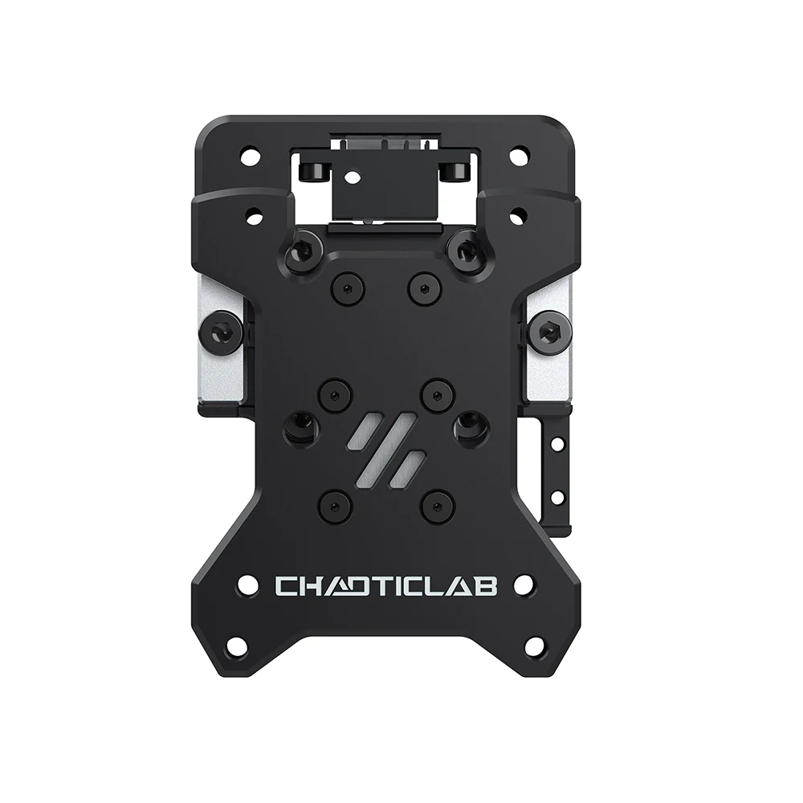

<!--
Because of the excitement, a vendor kinda jumped the gun and adapted the prototype version into a CNC metal version that they subsequently sold to users.

Unfortunately, the vendor didn't talk to the team and overlooked some important aspects of the design. This caused the CNC metal version to have some issues, and users, unaware, turned to the design team for support for a product they never had a say in. This wasn't great.
-->

---

# CNC Tap

<!-- footer: 'Image credit: [Chaoticlab](https://chaoticlab.xyz/products/cnc-voron-tap?variant=40293637161058)' -->
<!-- _class: screenshot -->
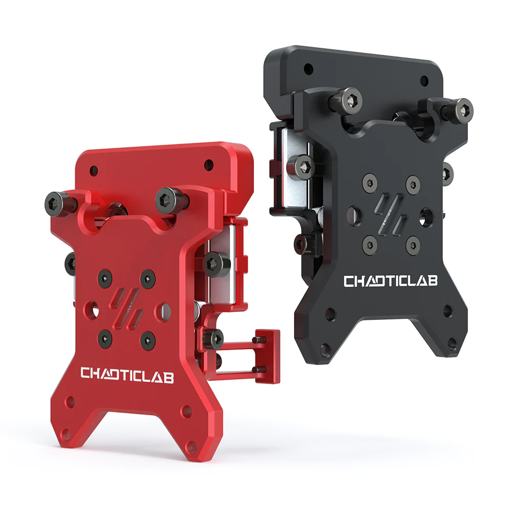

<!--
However, this lead to communication between the design team and the vendor. The team worked with the vendor to address the issues and helped to create and test a new, improved version. This experience also encouraged another vendor selling metal versions of tap to seek guidance from the design team as well.

While this isn't the ideal approach, it demonstrates the self-organizing and self-governing aspects of peer production that work to keep an ecosystem like this healthy.
-->

---

# Community means everyone

<!-- footer: '' -->
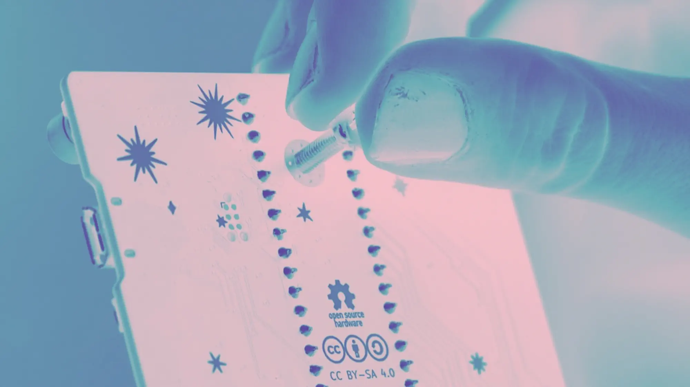

<!-- It shows that the Voron team, community, and vendors are inextricably entangled. Vendors succeed when they support the needs of the community, and the community benefits and grows by working with vendors to amplify the scale of the overall project. -->

---

# Virtuous cycle

<!-- footer: 'Image credit: [LDO Motion](https://ldomotion.com/p/guide/VORON-Leviathan-V12)' -->
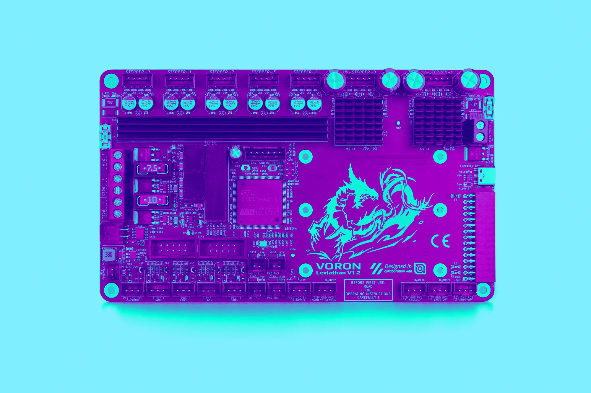

<!-- Vendors have contributed to the Voron community and project in so many ways. They significantly lower the barrier of entry, reduce the cost of components, make it far easier to acquire specialized components, provide support to end users, work with the design team to validate new designs, innovate with new ideas and products, sponsor and organize community events, and so much more. When it all comes together, it's a virtuous cycle. -->

---

# RepRap's legacy

<!-- _class: leading -->
<!-- footer: 'Image credit: [RepRap.org](https://reprap.org/wiki/File:PressPix-26806-0075.webp)' -->

<!--
Modern consumer 3d printers, including Voron, trace their lineage back to the RepRap project. The RepRap project ran with the dream of *democratizing* and *distributing* the means of production by creating a *self-replicating* machine that anyone could build, own, operate, and customize.
-->

---

# RepRap is alive with Voron

<!-- footer: 'Image credit: [Opulo](https://opulo.io)' -->
<!-- _class: hide-title -->
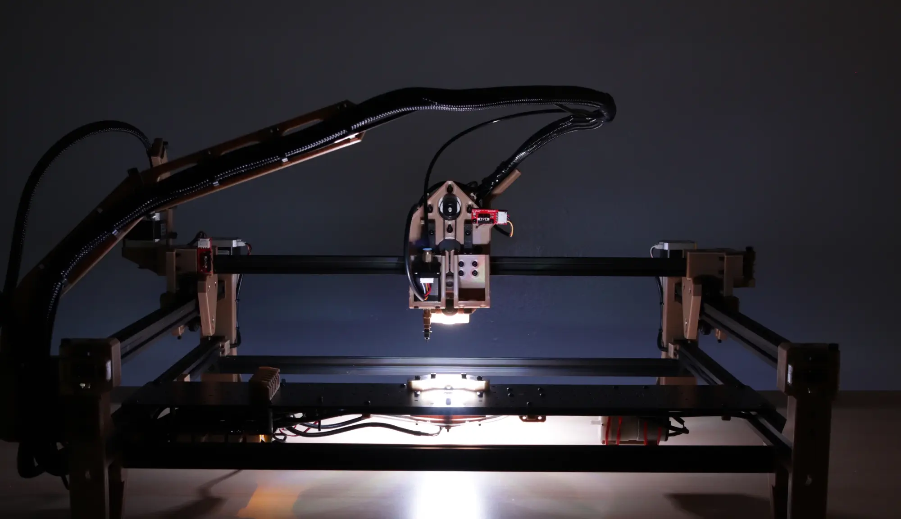

<!--
The present-day legacy of the RepRap project is alive and well within the Voron community: not only are they creating innovative, high-quality open hardware designs, but they have built a truly distributed, collaborative ecosystem that provides physical goods and supports the needs of the community. Their impact is far beyond their own community, as projects such as Printers for Ants, Milo, LumenPnP, and more benefit from the Voron ecosystem.
-->

---

# Viable peer production

<!-- footer: '' -->

<!--
While no ecosystem is perfect, Voron's continued growth and success shows that open hardware peer production can be viable in the real world, despite having to co-exist with prevailing capitalist methodologies. They've demonstrated that vendors can and should be part of the community, the project, and the conversation.

Open source is about empowerment, and communities like Voron show us that it's possible to succeed while empowering your entire community.
-->

---

# Thanks!

<!--
This short little talk wouldn't have been possible without the help of the Voron design team, Maple Leaf Makers, and West3D. I'd like to thank them for their time, and I'd like to thank you for listening to me.
-->

---

## Who am I?

<!-- class: gradient -->

- Thea Flowers ✨
- Creative technologist
- OSHWA board president

<!--
I'm Thea Flowers, known on the internet as "Stargirl".
I'm a creative technologist and a member of the open source hardware association's board of directors.
-->

---

<!-- _class: end -->

[thea.codes](https://thea.codes)
@theavalkyrie

<!--
Finally, if you want to follow me you can find me on the web at thea.codes. Thank you all so much for joining me today and I hope you have a lovely evening!
-->
